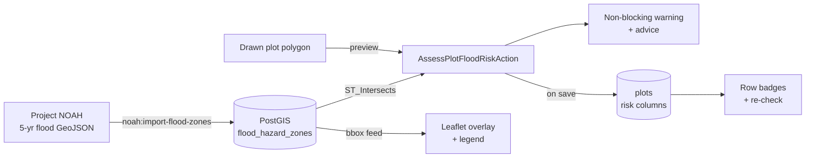
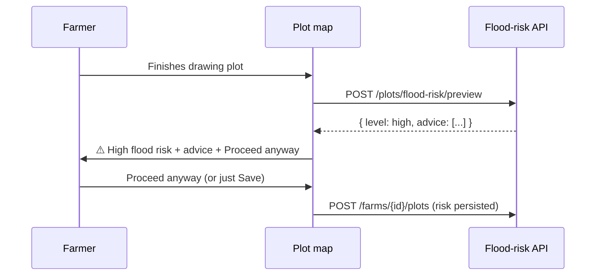

# 🌊 Flood Risk Mapping — Changelog

> **Hazard guide for every farm plot, powered by Project NOAH data.**
> Farmers see a color-coded flood overlay while drawing plots, get a plain-language
> warning when land sits in a hazard zone — and can always proceed anyway. This is a
> reminder, never a blocker.

   

---

## Screenshots

| Desktop | Mobile |
|---|---|
|  |  |

---

## What farmers get

| # | Feature | Where | Behavior |
|---|---------|-------|----------|
| 1 | 🗺️ **Flood hazard overlay** | Plot planner map | NOAH 5-year hazard polygons drawn under the plot layer; pointer-transparent so drawing still works |
| 2 | 🎨 **4-level legend** | Map corner + plot rows | Safe (green) · Low · Medium · High (red); keyboard-accessible overlay toggle |
| 3 | ⚠️ **Draw-time warning** | Save panel | Appears after finishing a sketch in a hazard zone, with mitigation advice and **Proceed anyway** — Save stays enabled throughout |
| 4 | 🔖 **Risk badges on saved plots** | Existing-plots list | Each row shows its level; **Details** reveals advice, **Re-check** refreshes against current hazard data |
| 5 | 💾 **Risk persisted per plot** | Database | Level, coverage flag, and assessed-at timestamp saved on plot creation |

**Design language:** Field & Linen tokens only (`moss`/`harvest`/`soil`/`dew`/`stone`), Lora headings, rounded organic surfaces, reduced-motion support.

---

## How it works

**Draw-time flow:**

---

## API changes

| Method & path | Purpose | Guards |
|---|---|---|
| `POST /api/v1/plots/flood-risk/preview` | Assess a drawn-but-unsaved polygon | auth, verified, `throttle:30,1` |
| `GET /api/v1/plots/{plot}/flood-risk` | Current assessment for a saved plot | auth, plot policy |
| `POST /api/v1/plots/{plot}/flood-risk/refresh` | Re-assess against latest hazard data | auth, verified, `throttle:30,1`, plot policy |
| `GET /api/v1/flood-hazard-zones?bbox=minx,miny,maxx,maxy` | GeoJSON hazard polygons for the map viewport | auth |

Validation: closed-ring GeoJSON polygons, bounded coordinates, bbox required — invalid shapes return `422`, out-of-policy access returns `403`/`404`.

---

## Data & deployment notes

1. **Migrate** — `php artisan migrate`
   - `2026_10_08_114551_create_flood_hazard_zones_table` → new `flood_hazard_zones` table (multipolygon + `hazard_class` + `return_period_years`)
   - `2026_10_08_115823_add_flood_risk_to_plots_table` → `flood_risk_level`, `flood_within_coverage`, `flood_risk_assessed_at` on `plots` (all nullable; legacy plots read as "not assessed")
2. **Import NOAH data** — `php artisan noah:import-flood-zones storage/noah/flood-5yr.geojson` (use `--return-period=` for other layers; V1 ships the 5-year layer)
3. **No new infrastructure** — hazard polygons are served as GeoJSON through the existing API (no tile server); overlay fetches per map viewport with debounce
4. **Backwards compatible** — all plot columns nullable; existing plots, exports, and AI flows untouched

---

## Files changed

**Backend** (`backend/`, DDD layout)

| Area | Files |
|---|---|
| Migrations | `database/migrations/2026_10_08_114551_create_flood_hazard_zones_table.php`, `2026_10_08_115823_add_flood_risk_to_plots_table.php` |
| Domain | `app/Domain/Farming/Models/FloodHazardZone.php`, `Enums/FloodRiskLevel.php`, `DTOs/FloodRiskAssessment.php`, `Actions/AssessPlotFloodRiskAction.php` |
| Console | `app/Console/Commands/ImportNoahFloodZonesCommand.php` |
| HTTP | `app/Farming/Controllers/PlotFloodRiskController.php`, `Controllers/FloodHazardZoneController.php`, `Requests/PreviewFloodRiskRequest.php`, `Requests/FloodZoneIndexRequest.php`, `Resources/FloodRiskResource.php` |
| Modified | `routes/api.php`, `app/Domain/Farming/Actions/CreatePlotAction.php`, `Models/Plot.php`, `app/Farming/Resources/PlotResource.php`, `Controllers/PlotController.php`, `phpstan-baseline.neon` |
| Tests | `FloodHazardImportTest`, `FloodRiskAssessmentTest`, `PlotFloodRiskTest` (+ boundary/error cases) |

**Frontend** (`frontend/src`, Atomic Design)

| Area | Files |
|---|---|
| New | `composables/useFloodRisk.js`, `molecules/FloodRiskLegend.vue`, `molecules/FloodRiskWarning.vue`, `atoms/FloodRiskBadge.vue` |
| Modified | `constants/designTokens.js` (legend tokens), `composables/usePlotMap.js` (overlay layer), `organisms/PlotDrawer.vue`, `pages/dashboard/PlotPlanner.vue` |
| Tests | `e2e/Farming/flood-risk.spec.js` (overlay · legend · warning · badges, chromium + mobile), unit specs for composable + all three components, `PlotPlanner.spec.js` updated for preview-then-confirm order |

---

## Verification (merged `develop` @ `19c9421`)

| Gate | Result |
|---|---|
| `./vendor/bin/pint --test` | ✅ 636 files pass |
| `./vendor/bin/phpstan analyse --level=6` | ✅ no errors |
| `php artisan test` | ✅ 895 passed (4 risky = pre-existing `Debug*` tests) |
| `npm run lint:check` (oxlint + ESLint) | ✅ 0 warnings, 0 errors |
| `npm run format:check` (Prettier) | ✅ clean |
| `npx vitest run` | ✅ 631 passed |
| `npm run build` | ✅ succeeds |
| Playwright `e2e/Farming` (chromium + mobile-chromium) | ✅ 12 passed, incl. keyboard toggle, no-overflow, draw-then-warn, proceed-anyway |

---

## Deliberately out of scope (V1)

- 25-year / 100-year return-period layers (importer supports them via `--return-period`; UI ships 5-year only)
- SMS/push flood alerts and seasonal auto-refresh
- Live NOAH tile dependency — rejected in favor of self-hosted polygons (works offline in CI, no third-party runtime dependency)

---

*Branch `feat/flood-risk-mapping` → merged into `develop`. Paste this file as-is into the GitHub PR body — screenshots resolve from `develop` once pushed.*
